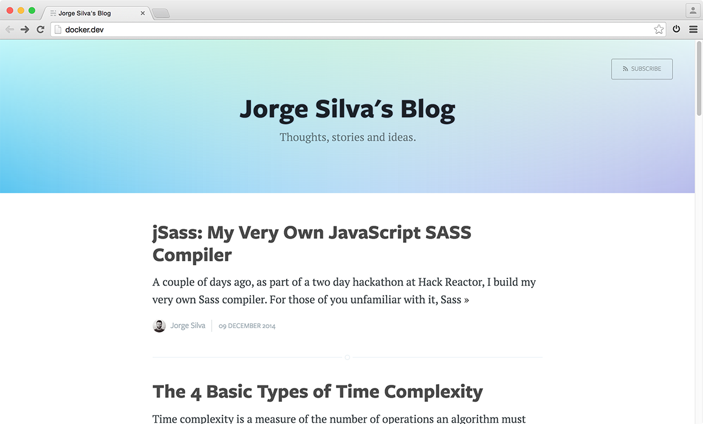

# Jorge Silva's Blog



A Ghost blog with a couple of improvements. 

### Docker Setups

In your local environment:

```
fig -f dev.yml build
fig -f dev.yml up -d
```

In your production environment:

```
fig -f prod.yml build
fig -f prod.yml up -d
```

Keep in mind, that this is meant to run behind nginx, so the ports on prod.yml are not accessible ports. Rather, they are meant to be routed to through nginx.